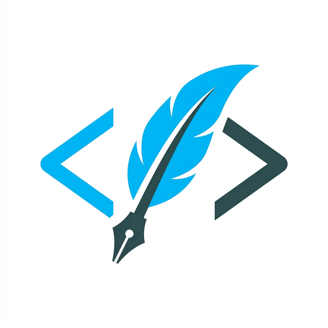

<p align="center">
  
</p>

<h1 align="center">墨思 (MoSi) - 我的前端学习与成长记录</h1>

<p align="center">
  <strong>一个基于 Vue 3 & Valaxy 构建的个人技术博客，记录从零到一的进阶之路</strong>
</p>

<p align="center">
  <a href="https://vuejs.org/">
    
  </a>
  <a href="https://valaxy.site/">
    
  </a>
  <a href="https://decapcms.org/">
    
  </a>
  <a href="https://vercel.com/">
    
  </a>
</p>

---

## 为什么要做这个项目？

我是一名正在努力学习前端开发的学生。在过去的一段时间里，我习惯使用 **Typora** 在本地记录笔记。虽然 Typora 的书写体验极佳，但随着笔记数量的增加，我发现：

1. **查阅不便**：本地笔记散落在不同文件夹，难以实现快速的交叉索引和随时随地的复习。
2. **缺乏交流**：学习是一个输入与输出的过程，我希望有一个平台能将我的所思所想分享给更多志同道合的朋友，在交流中共同进步。

因此，我决定通过二次开发优秀开源项目，搭建这个属于我自己的技术博客站点。

## 在原作者基础上的学习与思考

本项目基于 [YunYouJun/valaxy](https://github.com/YunYouJun/valaxy) 进行二次开发。在阅读和修改源码的过程中，我收获颇丰：

- **深度理解 SSG (静态站点生成)**：通过 Valaxy 了解到 Vite 驱动的预渲染机制，理解了为什么静态站点能拥有如此快的首屏加载速度。
- **插件化架构思想**：原作者将主题、搜索、评论等功能高度插件化，这种解耦的设计思路对我以后设计组件和系统有很大的启发。
- **现代化工具链**：第一次在实战中深度接触 **UnoCSS**（原子化 CSS）和 **Vue 3 Composition API**，深刻体会到了开发效率的提升。

## 我做了哪些改进？

为了让博客更符合我的使用习惯和学习需求，我在原版的基础上进行了以下改进：

### 1. 引入 Headless CMS (Decap CMS)

- **改进原因**：传统的静态博客需要通过 Git 提交 Markdown 文件，在手机或没有开发环境的情况下很难发布内容。
- **改进意义**：我集成了 Decap CMS，通过配置 YAML 模型实现了**可视化内容管理**。现在我即使不在电脑前，也能通过浏览器发布和修改博文。

### 2. 自研 Serverless 认证中转服务

- **改进原因**：Decap CMS 在使用 GitHub OAuth 时，由于其是纯前端应用，无法安全地处理 Client Secret。
- **改进意义**：我基于 **Vercel Serverless Functions**（位于 `/api` 目录）手写了一个简单的认证后端。这不仅解决了登录安全性问题，也让我对 OAuth 2.0 授权流程 and 后端开发有了初步的实战经验。

### 3. 构建结构化“八股文”知识库

- **改进原因**：作为学生，面试准备是重中之重，我需要一个专门的地方来整理前端面试题。
- **改进意义**：我利用 Valaxy 的导航和侧边栏系统，专门开辟了**结构化面试题库**模块，涵盖核心原理、手写代码、高频算法等，方便在手机上随时“刷题”和回顾。

## 技术栈

- **前端框架**: Vue 3.x (Composition API)
- **静态生成**: Valaxy (Vite-based SSG)
- **样式方案**: UnoCSS + valaxy-theme-yun
- **内容管理**: Decap CMS
- **后端支持**: Vercel Serverless Functions (Node.js)
- **部署自动化**: GitHub Actions + Vercel

## 快速开始

如果你也想基于此版本搭建自己的博客：

```bash
# 1. 克隆
git clone https://github.com/autopoet/my-blog.git

# 2. 安装
pnpm install

# 3. 运行预览
pnpm run dev

# 4. 构建 (SSG)
pnpm run build
```

---

> **致谢**：特别感谢 [YunYouJun](https://github.com/YunYouJun) 提供的优秀开源框架 Valaxy。

<p align="center">
  期待与每一个优秀的你在代码的世界相遇。
</p>
