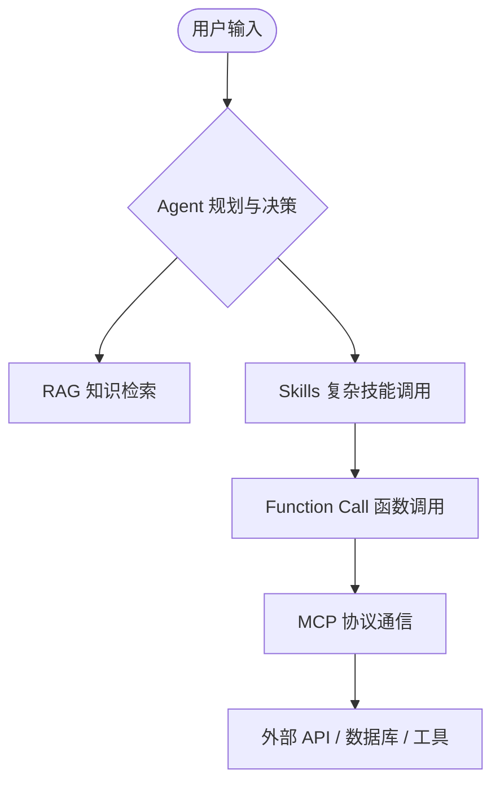

<ArticleViews slug="ai-basic-cognition" />

> AI 技术正如火如荼地改变着世界。了解大模型（LLM）的基础概念及其背后的技术体系，是掌握 AI 开发的第一步。

## 一、 基础概念

### 1. 什么是 LLM？和传统 NLP 有什么区别？

**LLM (Large Language Model)** 是基于 Transformer 架构的大规模预训练语言模型。它不再是单纯的“分词器”或“分类器”，而是一个通过海量数据学习了人类知识精髓的“数字大脑”。

#### **核心区别**

| 维度 | 传统 NLP | LLM |
| :--- | :--- | :--- |
| **范式** | 针对特定任务进行微调训练 | 预训练 + 提示词 (Prompt) |
| **数据需求** | 依赖大量人工标注数据 | 少量示例 (Few-shot) 甚至无需示例 |
| **泛化能力** | 弱，通常只能完成单一任务 | 强，具备跨领域的通用处理能力 |
| **逻辑推理** | 规则驱动，难以处理复杂逻辑 | 具备“涌现能力”，可进行链式推理 |

### 2. Prompt Engineering 策略

Prompt Engineering 是引导 LLM 生成高质量输出的艺术。

* Zero-shot：直接提问，不给任何参考示例。
* Few-shot：提供 2-3 个标准格式示例，让模型模仿。
* Chain-of-Thought (CoT)：引导模型“一步步思考”。
* Role Prompting：设定专业人设。
* Structured Output：要求以 JSON 或 Markdown 表格形式回复。

### 3. Token 与上下文窗口

*   **Token**：LLM 处理文本的最小核算单位。英文约 0.75 词/token，中文约 1-2 tokens/汉字。
*   **上下文长度**：决定了模型能“记住”多少内容。
    *   **太短**：无法处理长文档。
    *   **太长**：会导致注意力稀释（Lost in the Middle）及计算成本剧增。

### 4. 关键参数：Temperature / Top-p / Top-k

| 参数 | 作用 | 推荐值 (严谨类) | 推荐值 (创意类) |
| :--- | :--- | :--- | :--- |
| **Temperature** | 控制输出的随机性与创造力 | 0.1 - 0.3 | 0.7 - 1.0 |
| **Top-p** | 核心采样，从累积概率顶部的 Token 中选择 | 0.5 - 0.8 | 0.9+ |
| **Top-k** | 从概率最高的前 k 个词中采样 | 10 - 20 | 50+ |

### 5. Transformer 核心架构

**Transformer** 是 2017 年 Google 提出的基于注意力机制的神经网络架构，彻底抛弃了传统的 RNN/CNN，成为现代大模型的地基。

#### **核心组件与作用**
*   **Embedding**：将 token 转为高维向量。
*   **Positional Encoding**：由于模型同时处理所有 token，需要注入位置信息。
*   **Multi-Head Attention**：多头自注意力机制，捕捉不同维度的语义关系。
*   **Layer Norm & Residual Connection**：稳定训练，缓解深层网络梯度消失问题。

#### **Self-Attention：Q / K / V 分别是什么？**
在计算注意力时，每个 token 会生成三个向量：
1. **Q (Query)**：查询 — 表示当前 token 想查询什么信息。
2. **K (Key)**：键 — 表示每个 token 能提供什么信息。
3. **V (Value)**：值 — 实际传递的信息内容。

**计算流程**：`Attention(Q, K, V) = softmax(QK^T / sqrt(d_k)) * V`
*注：除以 sqrt(d_k) 是为了防止点积过大导致梯度消失。*

#### **为什么 Attention 比 RNN 强？**

| 特性 | RNN | Attention (Transformer) |
| :--- | :--- | :--- |
| **并行性** | 串行计算，速度慢 | 完全并行计算，速度快 |
| **长距离依赖** | 易产生梯度消失，难以捕捉 | 直接点对点连接，距离无关 |
| **可解释性** | 弱（黑盒状态） | 强（注意力权重可视化） |

#### **KV Cache：为什么能优化推理？**
KV Cache 缓存了生成过程中已计算 token 的 K 和 V 矩阵，避免了自回归生成时的重复计算。
*   **效果**：显著降低推理延迟，将时间复杂度从 O(n³) 降至 O(n²)。
*   **进阶**：如 PagedAttention (vLLM) 进一步优化了显存利用率。

---

## 二、 训练阶段 vs 推理阶段

| 维度 | 训练 (Training) | 推理 (Inference/Serving) |
| :--- | :--- | :--- |
| **目标** | 学习模式并更新参数 | 基于输入生成输出 |
| **计算方式** | 并行处理整个序列 | 自回归（逐个词生成） |
| **KV Cache** | 不需要 | **必须**，否则性能极低 |
| **精度** | 通常使用 FP16/BF16 | 常用量化技术（INT8/INT4） |

---

## 三、 幻觉 (Hallucination) 及其缓解

**幻觉**指的是 LLM 生成了看似合理但事实错误的内容。

**缓解策略**：
1.  **RAG (检索增强生成)**：给模型提供“开卷考试”的参考资料。
2.  **事实核查**：引入多个模型进行交叉验证。
3.  **约束生成**：强制输出符合特定 Schema。
4.  **置信度反馈**：要求模型评估自己回答的确定程度。

---

## 四、 核心 AI 技术体系

### 1. RAG / Agent / Function Calling / MCP / Skills

它们构成了现代 AI 应用的完整版图。

| 概念 | 定义 | 核心价值 |
| :--- | :--- | :--- |
| **RAG** | 检索增强生成 | 解决时效性与专业知识缺失 |
| **Agent** | 智能体 | 赋予模型规划与自主执行的能力 |
| **Function Call** | 函数调用 | 实现模型向外部世界的“输出”与控制 |
| **MCP** | 模型上下文协议 | 统一、标准化的工具通信准则 |
| **Skills** | 技能封装 | 高层能力抽象，将多个工具组合为复合能力 |

### 2. 它们之间的协作关系

我们可以用一幅图来理解这个生态系统：

**完整调用链**：
用户输入 → **Agent** 判定意图 → **RAG** 搜寻背景知识 → **Skills** 组合所需能力 → **Function Call** 构造参数 → **MCP** 安全通信 → 获取结果并返回。

<ArticleComments slug="ai-basic-cognition" />
