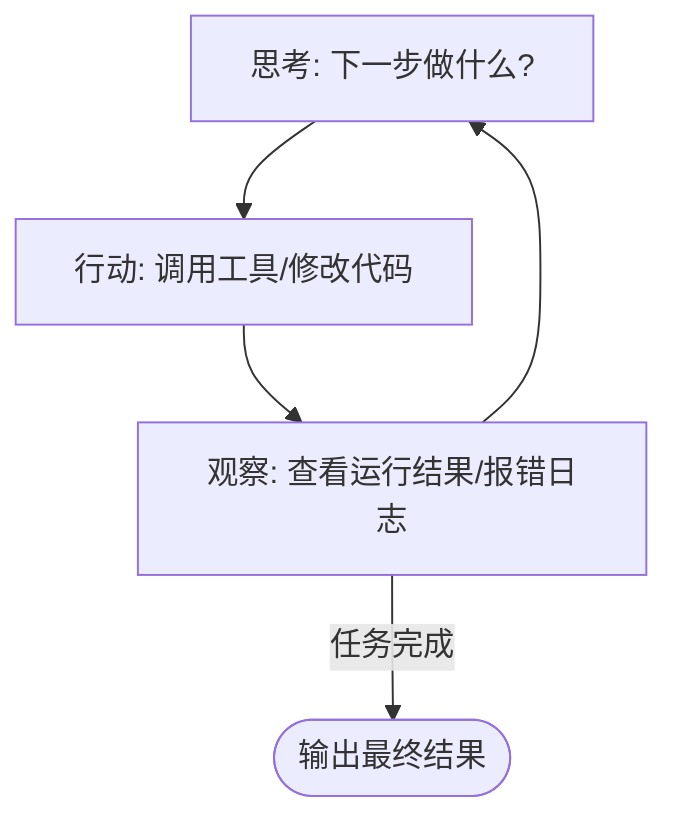

<ArticleViews slug="claude-code-vs-openclaw" />

> 本文带大家了解 Claude Code 与 OpenClaw 的工作原理，并分享在 Vue 3 项目中优雅指导 AI 写代码的实战技巧。

## 一、 Claude Code 是怎么工作的？

Claude Code 的工程实现是一个经典的 **Agent（智能体）架构**。它的核心原理可以概括为三个机制的有机结合：

### 1. LLM 作为“决策大脑”

它的底层通常是 **Claude 3.7 Sonnet** 这样具备极强代码逻辑推理能力的大模型。它是所有指令的发起者和逻辑的判断者。

### 2. Function Calling（函数调用）能力

这是最核心的魔法。Claude 本身没有“手”，但开发者通过 **MCP (Model Context Protocol)** 或类似的机制给它注入了一套本地工具：

- `read_file`: 读取项目文件。
- `write_file`: 写入修改后的代码。
- `execute_bash`: 执行终端命令。
- `search_grep`: 在全局范围内检索关键词。

当模型决定要看某个文件时，它会输出一个特定的指令，本地的代理程序（Agent）拦截到这个指令后，帮它去读取文件，再把内容喂回给模型。

### 3. REPL 循环（读取-求值-输出循环）

它在终端里运行，本质上是在执行一个 **思考 -> 行动 -> 观察结果 -> 再次思考** 的闭环。

> 例如：它写了一段测试代码，运行后报错了，它能自动读取到错误日志（观察结果），然后根据报错信息自动修改代码（行动），直到测试通过。

---

## 二、 OpenClaw 的实现逻辑

相比于闭源商业化的 Claude Code，开源的 **OpenClaw** 在原理思路上是一脉相承的，但它更偏向于极客化和高度可配置化。

### 1. 命令行与环境挂载

OpenClaw 作为一个 CLI 工具，其本质是一个用 Node.js 或 Python 编写的终端外壳。它通过解析本地的配置文件，将你的本地开发环境“暴露”给 AI。
*注：这也是为什么我们在配置环境变量和权限时偶尔会遇到一些折腾的报错。*

### 2. 上下文组装

在处理像 Vue 3 这样多文件嵌套的前端项目时，OpenClaw 会先扫描你的目录结构，将项目树作为系统提示词（System Prompt）的一部分发送给 LLM，让 AI 在改动代码前，脑子里先有一张“地图”。

### 3. 指令沙盒执行

为了安全，它在执行命令行操作（比如 `pnpm install` 或 `git commit`）时，通常会有确认机制或者运行在相对隔离的子进程中。

---

## 三、 实战：如何优雅地指导 AI 写代码？

在日常开发中，我建议遵循以下三个原则：

### 1. 提供精准的“工程化上下文”

不要对 AI 说：“帮我写个用户列表组件。”

**推荐写法：**

> “我正在使用 **Vue 3 (Script Setup 语法) + pnpm + Vite**。请帮我写一个用户列表组件，数据从 `src/stores/user.js` 的 **Pinia store** 中获取，并且尽量使用 **ES Modules** 标准导出。”

### 2. 划定清晰的“技术约束”

AI 往往喜欢“偷懒”，或者提供过时的代码。你必须明确指出架构要求。

- **避免冗余**：
  > “请使用 Element Plus 的**按需引入**语法，不要全局注册。”
- **性能优化**：
  > “对于这个非常简单的状态小圆点，不要使用庞大的 UI 库组件，请直接使用原生 HTML 标签加 **BEM 规范**的 CSS 手写，以减少 Vue 在运行时的 VDOM 对比负担。”

### 3. 拆解任务，步步为营

让 AI 一次性生成包含 API 请求、状态管理、路由配置和复杂 UI 的完整页面，翻车率极高。正确的做法是：

1. **Step 1**：“根据这段 JSON 数据，帮我用 Axios 封装一个获取数据的 API 方法，放在 `src/api` 下。”
2. **Step 2**：“写一个 Pinia Store 来调用刚才的 API 并存储数据。”
3. **Step 3**：“最后，写一个 Vue 视图组件来渲染这个 Store 里的数据。”

---

## 推荐阅读

如果你对 Agent 的底层原理感兴趣，欢迎阅读我的其他相关文章：

- [Agent 智能体基础](agent-intelligence-foundations.md)
- [AI 基础认知](ai-basic-cognition.md)

<ArticleComments slug="claude-code-vs-openclaw" />
