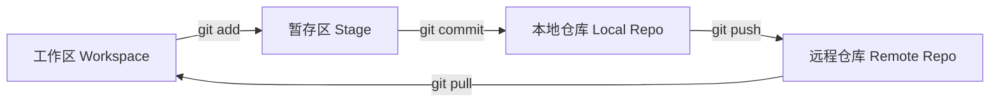

<ArticleViews slug="git-basics" />

> Git 是现代软件开发中不可或缺的版本控制工具。本文将带你从零开始掌握其核心命令。

## 1. 核心流程图

```mermaid
graph LR
    A[工作区 Workspace] -->|git add| B[暂存区 Stage]
    B -->|git commit| C[本地仓库 Local Repo]
    C -->|git push| D[远程仓库 Remote Repo]
    D -->|git pull| A
```

