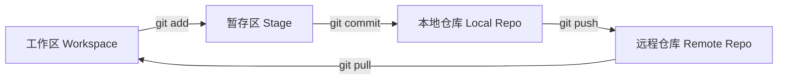

<ArticleViews slug="git-basics" />


> Git 是现代软件开发中不可或缺的版本控制工具。本文将带你从零开始掌握其核心命令。


## 1. 核心流程图



---

## 2. 常用基础命令

### **配置用户信息**

```bash
git config --global user.name "你的名字"
git config --global user.email "your_email@example.com"
```

### **基础三部曲**

1. **添加暂存**：`git add .` (添加所有改动)
2. **提交记录**：`git commit -m "提交说明"`
3. **推送到远程**：`git push origin main`

---

## 3. 分支管理：最强大的特性

分支允许你在不干扰主线的情况下并行开发。

- **创建分支**：`git branch <branch-name>`
- **切换分支**：`git checkout <branch-name>` (新版推荐 `git switch <branch-name>`)
- **合并分支**：切换回主分支后执行 `git merge <branch-name>`

> [!IMPORTANT]
> **黄金法则**：在提交代码前，总是先执行 `git pull` 以确保你的工作区是最新的，避免冲突。

---

## 4. 冲突解决技巧

当两个人修改了同一行代码时，Git 会报错。
1. 打开有冲突的文件，找到 `<<<<<<<`、`=======` 和 `>>>>>>>` 标记。
2. 手动保留需要的代码。
3. 重新 `add` 和 `commit`。

---

## 5. 总结

Git 的学习曲线虽然初看陡峭，但掌握了以上基础后，你已经能应付 90% 的开发场景。多练习，多看 `git status`。

<ArticleComments slug="git-basics" />
