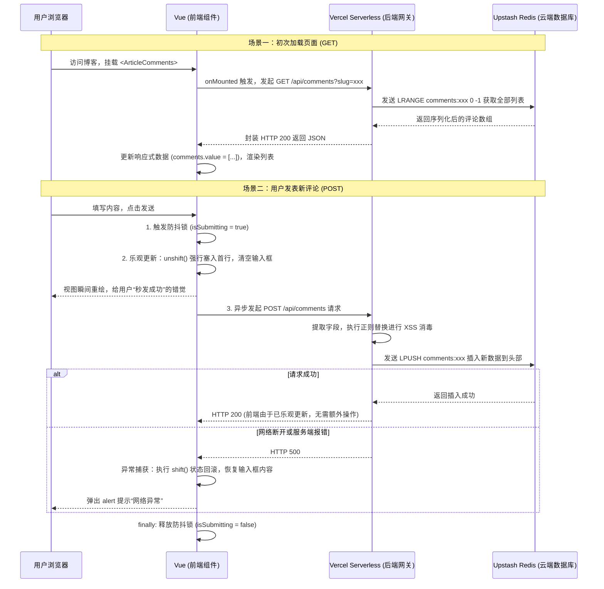

<ArticleViews slug="project-highlight-comments" />

## 一、 全局数据流转链路

当用户在前端页面点击进入博客（触发历史留言拉取），以及用户主动发表一条新评论时，系统底层经历了完整的全栈读写交互。整个流转链路可以划分为以下核心阶段：



### 阶段一：组件挂载与读数据 (GET 链路)

* **生命周期触发**：页面真实 DOM 渲染完毕后，安全触发 Vue 的 `onMounted`。前端利用 `fetch` 向 Serverless 发起同源 GET 请求。
* **Redis 列表读取**：Serverless 校验通过后，向 Redis 发送 `LRANGE key 0 -1` 指令，以 O(N) 复杂度一次性拉取该文章下的所有评论。
* **反序列化与渲染**：后端将 Redis 中的字符串数组反序列化为 JSON 返回给前端。前端将数组赋值给 `comments.value`，Vue 触发 VDOM Diff，渲染出评论列表。

### 阶段二：写操作与乐观更新 (POST 链路 —— 核心亮点)

* **状态锁拦截**：用户点击“发送”，前端首先检查 `isSubmitting` 锁。如果正在提交或内容为空，直接 return，从物理层面杜绝连击导致的脏数据。
* **乐观更新 (Optimistic UI)**：不等后端响应，前端立刻构建包含当前时间的评论对象，使用 `unshift` 将其推入响应式数组的头部，并清空输入框。用户体验极度流畅（0 延迟）。
* **纵深防御 (XSS 消毒)**：前端后台默默发起 POST 请求。Serverless 收到数据后，不完全信任客户端，立刻使用正则表达式（将 `<` 替换为 `&lt;`）进行二次消毒，彻底抹杀存储型 XSS 攻击的隐患。
* **原子推入与异常回滚**：Serverless 使用 `LPUSH` 将新评论以 O(1) 的复杂度推入 Redis 列表头部（与前端的 `unshift` 完美对称）。如果网络断开导致保存失败，前端捕获异常，利用 `shift` 弹出假数据，把文字还给用户，实现优雅的状态回滚。

---

## 二、 功能背景：为什么做？有什么好处？学到了什么？

*   **为什么要实现这个功能？**
    如果说浏览量统计只是单纯的“读与自增”，那么评论区则是真正展示了全栈工程师**“增删改查 (CRUD)”与复杂状态管理**的能力。引入评论系统，使得原本单向输出的静态博客具备了双向互动的社交属性，打破了纯前端项目的静态局限。
*   **有什么好处？**
    *   **极致用户体验**：通过引入“乐观更新 (Optimistic UI)”，将网络请求的延迟巧妙隐藏，达到了堪比原生 App 的顺滑发送体验。
    *   **高可用与低成本**：Redis 的 List 数据结构天生契合时间线评论流（双向链表），`LPUSH` 插入极快。结合 Serverless 的按需计费，实现了零运维的高性能后端。
*   **我们能从中学习到什么？**
    *   掌握了复杂的前端状态机设计（防抖锁、乐观更新、异常兜底回滚机制）。
    *   深刻理解了网络安全中的纵深防御理念，掌握了利用 Vue 文本插值与后端正则替换双管齐下防御 XSS 攻击的底层逻辑。
    *   理解了 RESTful API 的设计规范（同一个路径通过 GET/POST 区分读写），以及 Redis 的 List 数据结构特性。

---

## 三、 核心代码深度解析
### 1. 前端：Vue 组件代码 (`AppComment.vue`)

```vue
<script setup>
// 【逻辑】引入 Vue3 Composition API 的核心函数。
// 【考点】Tree-Shaking 机制：按需引入有利于打包工具剔除无用代码，减小产物体积。
import { ref, onMounted } from 'vue'

// 【逻辑】定义入参。
// 【考点】单向数据流原则。子组件只能读取 slug，绝不能直接修改，保证状态可预测。
const props = defineProps({
  slug: { type: String, required: true }
})

// 【逻辑】定义响应式变量。isSubmitting 是防抖锁，防止用户连击发送脏数据。
// 【考点】Vue3 Proxy 响应式原理。修改 value 时会触发依赖收集和视图更新。
const comments = ref([])
const author = ref('')
const content = ref('')
const isSubmitting = ref(false)
const isLoading = ref(true)

// 【逻辑】初次加载：获取历史留言。
onMounted(async () => {
  try {
    const res = await fetch(`/api/comments?slug=${props.slug}`)
    const data = await res.json()
    comments.value = data.comments || []
  } catch (e) {
    console.error('加载评论失败', e)
  } finally {
    isLoading.value = false
  }
})

// 【逻辑】提交新评论核心逻辑。
const submitComment = async () => {
  // 【逻辑】前置拦截：防止空内容和连击重复提交。
  if (!content.value.trim() || isSubmitting.value) return

  // 【逻辑】上锁。此时按钮会被禁用。
  isSubmitting.value = true

  const newComment = {
    author: author.value.trim() || '匿名访客',
    content: content.value.trim(),
    date: new Date().toLocaleString('zh-CN', { hour12: false })
  }

  // --- 【面试最核心亮点：乐观更新 (Optimistic UI)】 ---
  // 【逻辑】不等网络请求，直接将数据插入前端数组头部（unshift），触发视图秒级重绘。
  // 【考点】极致的用户体验设计。各大厂社交产品点赞、评论的标准做法，掩盖网络延迟。
  comments.value.unshift(newComment)

  // 【逻辑】提前把输入框清空，给用户反馈。备份用户输入的内容以防万一。
  const tempContent = content.value
  content.value = ''

  try {
    // 【逻辑】真正发起 POST 请求同步到云端。
    const res = await fetch('/api/comments', {
      method: 'POST',
      headers: { 'Content-Type': 'application/json' },
      body: JSON.stringify({
        slug: props.slug,
        author: newComment.author,
        content: newComment.content,
        date: newComment.date
      })
    })

    // 【考点】fetch 的容错机制。fetch 只有在断网时才会抛出 catch，对于 HTTP 4xx/5xx 需要手动判断 res.ok 并抛出异常。
    if (!res.ok) {
      throw new Error('服务器端保存失败')
    }
  } catch (error) {
    // --- 【异常处理与状态回滚】 ---
    console.error('评论提交真实失败，触发状态回滚', error)
    // 【逻辑】如果后端报错或断网，把刚才假冒的那条数据从列表里删掉（shift 撤回）。
    // 【考点】高级前端的工程素养：完善的异常状态机，保证前后端数据最终一致性。
    comments.value.shift()
    content.value = tempContent // 把文字还给用户
    alert('网络异常，评论发布失败请重试')
  } finally {
    // 【逻辑】无论成功失败，恢复按钮状态，释放防抖锁。
    isSubmitting.value = false
  }
}
</script>

<template>
  <div v-else-if="comments.length > 0">
    <div v-for="(item, index) in comments" :key="index">
      <strong style="color: #333;">@{{ item.author }}</strong>

      <div>{{ item.content }}</div>
    </div>
  </div>
</template>
```

### 2. 后端：Serverless 接口代码 (`api/comments.js`)

```javascript
export default async function handler(req, res) {
  // 【逻辑】读取环境变量，实现敏感密钥与代码的物理隔离。
  const url = process.env.UPSTASH_REDIS_REST_URL;
  const token = process.env.UPSTASH_REDIS_REST_TOKEN;

  // 【逻辑】服务优雅降级。如果没有配环境，直接返回空数组，不导致前端白屏。
  if (!url || !token) {
    return res.status(200).json({ comments: [] });
  }

  // --- 处理 GET 请求：获取文章的所有评论 ---
  // 【考点】RESTful 规范。用请求方法 (GET/POST) 区分业务动作。
  if (req.method === 'GET') {
    const { slug } = req.query;
    if (!slug) return res.status(400).json({ error: '缺少 slug' });

    try {
      // 【逻辑】发送 Redis 原生命令 LRANGE 获取指定范围的列表元素。
      // 【考点】Redis 数据结构选型。由于评论具有严格的时间顺序，使用 List（底层双向链表）最为契合。0 到 -1 代表取出所有数据。
      const response = await fetch(`${url}`, {
        method: 'POST',
        headers: { Authorization: `Bearer ${token}`, 'Content-Type': 'application/json' },
        body: JSON.stringify(["LRANGE", `comments:${slug}`, "0", "-1"])
      });
      const data = await response.json();

      // 【逻辑】由于存入 Redis 时是 JSON 字符串，这里必须 map 遍历进行 JSON.parse 反序列化。
      const comments = data.result ? data.result.map(c => JSON.parse(c)) : [];
      return res.status(200).json({ comments });
    } catch (error) {
      return res.status(500).json({ error: '获取失败' });
    }
  }

  // --- 处理 POST 请求：提交新评论 ---
  if (req.method === 'POST') {
    try {
        const { slug, author, content, date } = req.body;

        // 【逻辑】参数非空校验。 HTTP 400 状态码代表客户端请求参数错误。
        if (!slug || !content) {
            return res.status(400).json({ error: '缺少必要参数' });
        }

        // --- 【核心安全考点：后端的纵深防御 (XSS 消毒)】 ---
        // 【逻辑】利用正则表达式将尖括号转义。
        // 【考点】"永远不要相信客户端传入的数据"。即使前端 Vue 做了转义，黑客依然可以通过 Postman 绕过浏览器直调接口。在入库前消毒，保证数据库层面的绝对纯净。
        const safeContent = content.replace(/</g, "&lt;").replace(/>/g, "&gt;");
        const safeAuthor = (author || '匿名访客').replace(/</g, "&lt;").replace(/>/g, "&gt;");

        const newComment = {
            author: safeAuthor,
            content: safeContent,
            date: date || new Date().toISOString()
        };

        // 【逻辑】发送 Redis 原生命令 LPUSH。
        // 【考点】LPUSH 从列表左侧（头部）插入数据，时间复杂度为 O(1)。这与前端的 unshift 操作完美对称，保证了最新的评论永远在最前面。
        const response = await fetch(`${url}`, {
            method: 'POST',
            headers: {
                Authorization: `Bearer ${token}`,
                'Content-Type': 'application/json'
            },
            // 【逻辑】对象必须序列化为 JSON 字符串才能存入 Redis。
            body: JSON.stringify(["LPUSH", `comments:${slug}`, JSON.stringify(newComment)])
        });

        if (response.ok) {
            return res.status(200).json({ success: true, comment: newComment });
        } else {
            return res.status(500).json({ error: '保存失败' });
        }

    } catch (error) {
        return res.status(500).json({ error: '提交失败' });
    }
  }

  // 【考点】如果有人发了 PUT 或者 DELETE 请求，返回 405 Method Not Allowed，符合 HTTP 标准规范。
  return res.status(405).json({ error: 'Method Not Allowed' });
}
```

---

## 1. 为什么不用现成的第三方评论插件（如 Waline/Giscus）？

在简历上面试官如果问起：“现在很多静态博客都有成熟的评论组件配置，你为什么要自己手写？”

**你的完美对答：**
“为了彻底打通这套全栈体验闭环。如果仅仅在配置文件里贴一行引入代码，那只能叫‘运维配置’，无法体现我作为**前端开发**的核心编码能力。
因为我本身通过 Serverless 已经连通了云端 Redis 数据库，所以我选择自己手写一个轻量级的 Vue3 表单组件和 API 接口。这样不仅让我深入实践了**组件的双向数据流转**、**网络请求封装**，我还特意在前端层面进行了**核心体验优化（如乐观更新）**和**安全防御（如XSS转义防范）**。这些都是集成现成插件所学不到的前端底层与业务经验。”

---

## 2. 前端核心亮点一：乐观更新 (Optimistic UI)

这是大型 C 端项目极度常用的体验提升技巧，但很多在校生根本没听说过，说出来绝对会让面试官眼前一亮。

**面试官提问：** “如果用户网速很慢，或者你的 Serverless 接口响应由于冷启动有点卡，用户点击了‘发送评论’之后，页面一点反应都没有，你会怎么解决这种不良体验？”

**你的完美对答：**
“其实我在写发送逻辑时就考虑到了网络延迟的问题。大多数初学者的做法是：`展现 Loading 动画 -> 等待后端返回成功 -> 重新拉取一次整个评论列表`。这既慢又费流量。
我使用的是**‘乐观更新（Optimistic UI）’策略**：在通过了前置空校验后，我不等网络请求发出去，立刻把用户刚刚填写的那条评论内容构建成一个展示模型，直接 `unshift`（推入）到我本地的 `comments` 响应式数组最顶端。
对于用户来说，他是**零延迟**地看到了自己的评论出现在页面上。而底层真实发送给后端接口的网络请求是在后台静默执行的，以此给用户极致流畅的交互体验。”

**面试官追问：** “那如果底层的那个网络请求真的失败了呢？”
**你的完美对答：**
“如果通过 `try-catch` 捕获到后台请求异常抛出了错误，我会在 `catch` 代码块里进行**状态回滚**：将刚才前端数组里第一项（那条虚假乐观数据）`shift`（弹出）删掉，并弹出友好提示，同时将被清空的输入框内容按变量填回，让用户可以随时无缝重试，形成绝对安全的业务闭环。”

---

## 3. 前端核心亮点二：前端安全之防范 XSS 攻击

对于任何具有“用户可以任意输入然后展示给所有人的富文本区”，**XSS（跨站脚本攻击）** 是一定绕不开的红线问题。

**面试官提问：** “你的留言板允许访客随便写东西，如果有个懂技术的黑客，在输入框里写了 `<script>alert('你的网站被黑了！')</script>`，你页面会被注入弹窗病毒吗？”

**你的完美对答：**
“完全不会。在这套项目中我设计了**两道防线**：
1. **渲染层面的天然防御**：在使用 Vue3 渲染评论列表时，我使用的是双花括号插值 `{{ item.content }}` 来输出文本，这确保了 Vue 模板引擎在渲染前会自动对尖括号等非法字符进行 DOM 生态安全的字符实体转义处理（无论是什么代码，都会被安全地当做纯文本展示），而绝不会使用会导致存储型 XSS 的 `v-html` 指令。
2. **接口存储层的深层拦截**：虽然前端显示没问题了，为了保证任何人调用我的 API 也无法污染数据库，在 Serverless 端收到 POST 数据的第一时间，我使用正则手动将 `<` 替换为了 `&lt;`，从源头污染库杜绝了危险脚本入库。前后两道防线，彻底杜绝了基本的反射型与存储型 XSS 的风险。”

---

## 4. 其它细节点串讲词

除了上面两个核心回答，如果你想在介绍项目时显得你极其严谨，你可以不经意地脱口而出以下几点：

*   **按钮防抖与锁定**：“考虑到快速连击可能导致脏数据写入，我在点击提交的瞬间挂载了 `isSubmitting` 锁变量，将其绑定到按钮的 `:disabled` 属性以及透明度的动态样式上，并在接口的 `finally` 生命周期里解锁。”
*   **无状态组件分发**：“因为 Valaxy 博客是由很多 Markdown 文件构成的，我把整个逻辑抽离成了高度内敛独立的 `<ArticleComments />` 组件，只需要像之前一样通过 `slug` 传值，就能立刻让任意枯燥的文章获得专属全网在线讨论能力。”
*   **组件双向绑定**：“对于评论昵称和内容框，我采用原生的 `v-model` 进行 Vue 双向状态绑定，比原生 JS 手写事件监听优雅得多。”

---

<ArticleComments slug="project-highlight-comments" />
