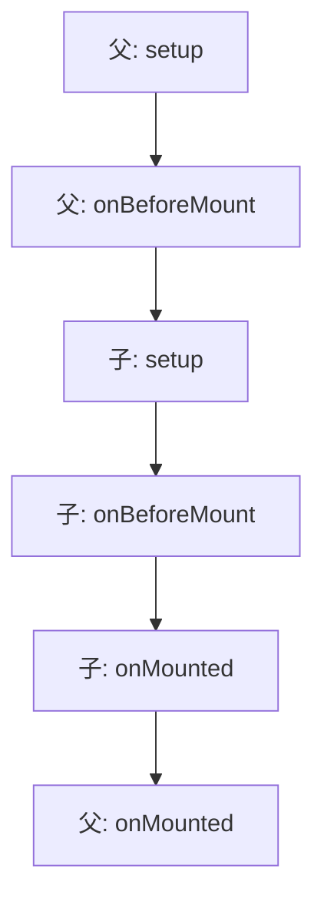

<ArticleViews slug="vue-lifecycle" />

> **一句话定义**：生命周期钩子（Lifecycle Hooks）就是 Vue 实例从“出生”到“死亡”过程中，在特定时刻自动触发的一系列 **“回调函数”**。你可以理解为机器人出厂流程中的各个质检点。

---

## 1. 为什么需要生命周期？

*   **开发者介入点**：给开发者提供在特定时机（如数据初始化、DOM 挂载等）介入代码的机会。
*   **代码解耦**：如果不使用生命周期，你无法确定数据、DOM 或第三方插件是否已就绪，导致业务逻辑与框架内部执行顺序混淆在一起。

---

## 2. 核心阶段与常用钩子（Vue 3 为例）

| 阶段 | 钩子名称 | 状态描述 | 典型用途 |
| :--- | :--- | :--- | :--- |
| **创建 (Initialization)** | `setup()` *(替代 beforeCreate)* | 访问不到 `data`，尚未完成数据监测 | 几乎不使用 |
| | `setup()` *(替代 created)* | **【常用】** 数据准备完毕，但尚未生成 HTML | 发起异步 Ajax 请求、初始化非响应式变量 |
| **挂载 (Mounting)** | `onBeforeMount` | 虚拟 DOM 已生成，尚未插入真实网页 | 几乎不使用 |
| | `onMounted` | **【常用】** 真实 DOM 已挂载完成 | 操作 DOM、初始化 Echarts/Swiper、开启定时器 |
| **更新 (Updating)** | `onBeforeUpdate` | 数据已变更，但页面尚未重绘 | 记录更新前的快照（如滚动位置） |
| | `onUpdated` | 页面重绘完成 | **禁止在此处修改数据**（会触发死循环） |
| **销毁 (Unmounting)** | `onBeforeUnmount` | 实例准备销毁，仍可访问数据与 DOM | 善后工作（清理副作用） |
| | `onUnmounted` | **【常用】** 实例彻底消失 | 清理定时器、解绑全局事件、关闭 WebSocket |

---

## 3. 核心进阶：技术要点深挖

### 关于请求发送时机的抉择
> **深度探讨**： “在哪个钩子发请求最为合适？背后的逻辑是什么？”

* **首选 `setup()`**：此时响应式数据已初始化，越早触发请求可以缩短白屏时间。
* **必须选 `onMounted` 的场景**：如果请求结果需要直接操作 DOM 元素（如：初始化图表、插件），必须等到 DOM 挂载完成后。
* **SSR 考虑**：在服务端渲染时，`onMounted` 钩子不会执行。为了兼容 SSR，通常根据业务逻辑在 `setup()` 或 `onMounted` 之间权衡。

### 销毁阶段的“副作用清理”
> **深度探讨**： “组件销毁时，通常需要做哪些清理工作？如果不清理会有什么后果？”

这是预防 **内存泄漏 (Memory Leak)** 的核心工作，主要包括以下三类：
1. **全局监听器**：手动移除在 `window` 或 `document` 上绑定的事件（`resize`、`scroll` 等）。
2. **计时器**：调用 `clearInterval` 或 `clearTimeout`。
3. **第三方实例**：调用高德地图、Video.js 等插件的 `destroy()` 方法，释放显存和内存。

### 底层视角下的四个阶段（资源形态转换）
> **深度探讨**： “如何从资源流转的角度理解 Vue 生命周期的四个核心阶段？”

* **创建 (Creation)**：**『从无到有』**。处理 JavaScript 层面的逻辑，将普通的 Data 转化为响应式对象。此时无 DOM。
* **挂载 (Mounting)**：**『从虚到实』**。将编译好的虚拟 DOM 转换成真正的 HTML 并插入目标容器。
* **更新 (Updating)**：**『按需微调』**。基于 Diff 算法计算出最小补丁，执行“微手术”而非暴力重刷。
* **销毁 (Unmounting)**：**『善后撤场』**。解开指令绑定和观察者，开发者需手动释放开启的全局资源。

---

## 4. 进阶：父子组件执行顺序

这是一个典型的“嵌套包裹”加载逻辑：

*   **加载过程口诀**：父先创，子后创；子先挂，父后挂。
*   **销毁过程顺序**：`父 onBeforeUnmount` -> `子 onBeforeUnmount` -> `子 onUnmounted` -> `父 onUnmounted`。

<ArticleComments slug="vue-lifecycle" />
