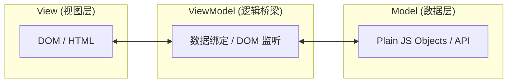

<ArticleViews slug="vue-mvvm" />


> MVVM 是 Vue 等现代前端框架的灵魂。理解其核心思想，是从指令驱动进化到数据驱动开发模式的第一步。

# MVVM 架构模式详解

## 1. 什么是 MVVM？

**MVVM (Model-View-ViewModel)** 是一种架构模式。它的核心是通过数据绑定实现 View 与 Model 的自动同步。

### 架构图示



### 职责划分

| 层级 | 职责 | 是否依赖框架 |
| :--- | :--- | :--- |
| **Model** | 数据模块，包含业务规则、API 请求和数据结构 | ❌ 独立于 UI |
| **View** | 用户界面（HTML/CSS），只负责展示，不处理逻辑 | ✅ 依赖 UI 框架 |
| **ViewModel** | 连接 Model 与 View 的“桥梁”，处理业务逻辑、状态管理 | ✅ 但不直接操作 DOM |

> **核心思想**：**View 和 Model 完全解耦。** ViewModel 负责监控 Model 数据的变化并通知 View 更新，同时也监听 View 的交互来修改 Model。

---

## 2. MVVM 的核心优势（为什么有它）

### ✅ 分离关注点，降低耦合
- **View** 只管“怎么显示”，**ViewModel** 只管“逻辑处理”。
- 修改 UI 布局不影响业务逻辑，方便并行开发。

### ✅ 双向数据绑定（以 Vue 为例）

```vue
<input v-model="username" />
<!-- 底层原理：
  :value="username"
  @input="username = $event.target.value"
-->
```

- **View → Model**：用户输入时，自动更新变量数据。
- **Model → View**：代码修改变量时，页面元素自动刷新。

> **底层逻辑探讨**：*“Vue 作为一个现代框架，在 MVVM 系统中扮演着什么角色？”*
> **深度解析**：Vue 是 MVVM 架构的高效工程化实现工具。**每一个 `.vue` 单文件组件都可以看作是一个完整的 MVVM 封闭单元**：`<template>` 定义了 View 层，`<script>` 逻辑块承载了 ViewModel 的职责，而组件内部维护的状态（如 `props`、`data`、`ref`）则构成了数据 Model。

---

## 3. MVVM 在 Vue 中的体现

| MVVM 层级 | Vue 中的对应实现 |
| :--- | :--- |
| **Model** | `props`、`data()`、`reactive` 数据对象、Pinia/Vuex 状态 |
| **View** | `<template>` 中的 HTML 结构与指令 |
| **ViewModel** | `setup()`、`methods`、`computed`、`watch` 等逻辑块 |

> **结论**：Vue 组件 = 一个完整的 MVVM 现代实现单元。

---

## 4. 局限性

- **性能开销**：对于海量数据流，ViewModel 维护的大量代理（Proxy/Watcher）会消耗额外的内存和 CPU。
- **调试黑盒**：某些报错可能由于 Vue 内部更新队列引起，若不熟悉原理，难以辨别是 Model 逻辑错误还是 View 绑定异常。
- **SEO 挑战**：纯客户端渲染的 MVVM 架构对爬虫不够友好（需配合 Nuxt.js 等 SSR 方案解决）。

---

## 5. 核心机制深度探究

### 逻辑层与视图层的依赖收集机制
> **深度讨论**： “在 Vue 响应式系统中，数据状态变更如何驱动局部组件的精准更新？”

1. **响应式拦截 (Reactivity)**：在组件初始化阶段，Vue 通过 `Proxy` 为数据安装“监听器”。每个响应式属性在底层都关联着一个专门的依赖管理器 **Dep (Dependency)**。
2. **触发读取 (Track)**：视图层在首次渲染或重绘时会读取对应数据（如 `{{ name }}`），这一动作会触发属性的 **Getter** 拦截器。
3. **依赖注册 (Collect)**：当前活跃的 **Watcher**（负责驱动页面更新的观察者）会被自动注册到该属性对应的 **Dep** 订阅名单中。

**【生动比喻】**：这就像是你订阅了某个技术博主（数据源），后续该博主的所有更新动态都会通过精准推送（Dep）告知所有订阅者，而无需进行全网广播。

### 派发更新 (Trigger) 的全链路流程
> **深度讨论**： “当在代码逻辑中执行数据赋值动作后，底层的更新流水线是如何运转的？”

1. **Setter 拦截**：数据发生变更，立刻触发预设的 **Setter** 拦截器。
2. **更新信号传递**：关联的 **Dep** 管理器接收到 Setter 发出的变更信号。
3. **通知订阅者**：**Dep** 遍历其存储的订阅名单，调用所有相关 **Watcher** 的 `update` 驱动方法。
4. **异步队列调度 (NextTick)**：Vue 会将所有待处理的更新任务推入微任务队列，利用批处理机制避免无效的 DOM 频繁操作。
5. **虚拟 DOM 对比 (Diff)**：进入重绘阶段，通过算法计算新旧虚拟节点之间的差异补丁（Patch）。
6. **真实 DOM 应用**：将最终计算出的差异量集，批量应用到浏览器的真实宿主环境中，完成最后的视觉呈现。

<ArticleComments slug="vue-mvvm" />
