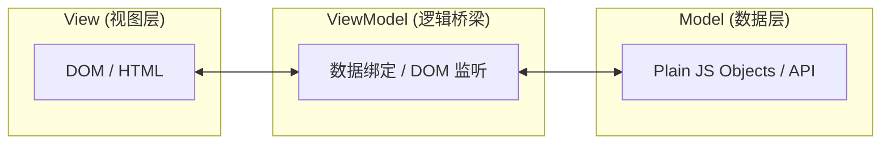

<ArticleViews slug="vue-mvvm" />

> MVVM 是 Vue 等现代前端框架的灵魂。理解其核心思想，是从指令驱动进化到数据驱动开发模式的第一步。

# MVVM 架构模式详解

## 1. 什么是 MVVM？

**MVVM (Model-View-ViewModel)** 是一种架构模式。它的核心是通过数据绑定实现 View 与 Model 的自动同步。

### 架构图示

### 职责划分

| 层级 | 职责 | 是否依赖框架 |
| :--- | :--- | :--- |
| **Model** | 数据模块，包含业务规则、API 请求和数据结构 | ❌ 独立于 UI |
| **View** | 用户界面（HTML/CSS），只负责展示，不处理逻辑 | ✅ 依赖 UI 框架 |
| **ViewModel** | 连接 Model 与 View 的“桥梁”，处理业务逻辑、状态管理 | ✅ 但不直接操作 DOM |

> **核心思想**：**View 和 Model 完全解耦。** ViewModel 负责监控 Model 数据的变化并通知 View 更新，同时也监听 View 的交互来修改 Model。

<ArticleComments slug="vue-mvvm" />
