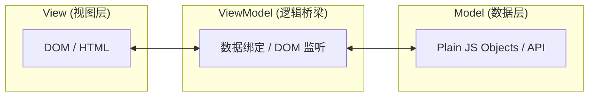

> MVVM 是 Vue 等现代前端框架的灵魂。理解其核心思想，是从指令驱动进化到数据驱动开发模式的第一步。

# MVVM 架构模式详解

## 1. 什么是 MVVM？

**MVVM (Model-View-ViewModel)** 是一种用于分离用户界面（UI）逻辑与业务逻辑的软件架构模式。它的核心是通过数据绑定实现 View 与 Model 的自动同步。

### 架构图示



### 职责划分

| 层级 | 职责 | 是否依赖框架 |
| :--- | :--- | :--- |
| **Model** | 数据模块，包含业务规则、API 请求和数据结构 | ❌ 独立于 UI |
| **View** | 用户界面（HTML/CSS），只负责展示，不处理逻辑 | ✅ 依赖 UI 框架 |
| **ViewModel** | 连接 Model 与 View 的“桥梁”，处理业务逻辑、状态管理 | ✅ 但不直接操作 DOM |

> **核心思想**：**View 和 Model 完全解耦。** ViewModel 负责监控 Model 数据的变化并通知 View 更新，同时也监听 View 的交互来修改 Model。

---

## 2. MVVM 的核心优势

### ✅ 分离关注点，降低耦合
- **View** 只管“怎么显示”，**ViewModel** 只管“逻辑处理”。
- 修改 UI 布局不影响业务逻辑，方便并行开发。

### ✅ 双向数据绑定（以 Vue 为例）

```vue
<input v-model="username" />
<!-- 底层原理：
  :value="username"
  @input="username = $event.target.value"
-->
```

- **View → Model**：用户输入时，自动更新变量数据。
- **Model → View**：代码修改变量时，页面元素自动刷新。

> **你的疑问**：*“Vue 是一个框架，那 Vue 组件是什么角色？”*
> **答**：Vue 是实现 MVVM 的工具。**一个 `.vue` 组件就是一个 MVVM 的封装体**：`<template>` 是 View，`<script>` 是 ViewModel，而它处理的数据对象（如 `props`/`data`）就是 Model。

---

## 3. MVVM 在 Vue 中的体现

| MVVM 层级 | Vue 中的对应实现 |
| :--- | :--- |
| **Model** | `props`、`data()`、`reactive` 数据对象、Pinia/Vuex 状态 |
| **View** | `<template>` 中的 HTML 结构与指令 |
| **ViewModel** | `setup()`、`methods`、`computed`、`watch` 等逻辑块 |

> **结论**：Vue 组件 = 一个完整的 MVVM 现代实现单元。

---

## 面试总结（推荐说法）

> “MVVM 是一种将应用程序分为 **Model（数据）、View（界面）、ViewModel（逻辑桥梁）** 三层的架构模式。它的核心价值在于**解耦 UI 与业务逻辑**，通过**双向数据绑定**大幅减少了手动操作 DOM 的复杂性。
>
> 在 Vue 开发中，每个组件本质上都是一个 MVVM 单元：
> - **Model** 对应响应式数据源；
> - **View** 是经由指令增强的模板描述；
> - **ViewModel** 则是我们的组件逻辑层，它通过 Vue 内置的响应式系统，让数据变化能即时反馈到界面，同时处理用户的交互事件并更新数据。
>
> 这种设计极大提升了代码的**可维护性、可测试性和团队协作效率**。”
