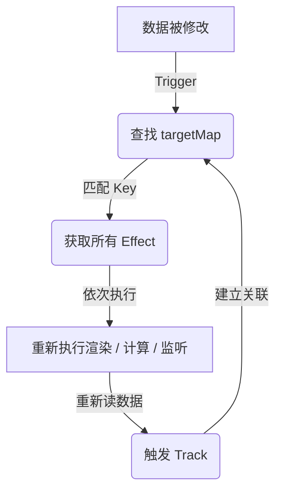

> 掌握响应式系统中的核心关键词（如 Proxy, track, trigger 等），不仅能加深对 Vue 运行机制的理解，更是应对大厂面试的必备利器。

# Vue 响应式核心关键词详解

---

## 1. `Proxy` vs `Object.defineProperty`

### 通俗解释
- **Object.defineProperty**：Vue 2 的响应式基础，像给已有的房间装监控（只能监听**已存在的属性**）。
- **Proxy**：Vue 3 的响应式基础，像在整栋大楼门口装探头（能代理**整个对象**，任何角落的操作都逃不过）。

### 技术对比

| 特性限制 | `Object.defineProperty` (Vue 2) | `Proxy` (Vue 3) |
| :--- | :--- | :--- |
| **新增属性** | ❌ 无法监听（需借用 `$set`） | ✅ 原生支持 |
| **删除属性** | ❌ 无法监听（需借用 `$delete`） | ✅ 原生支持 (`deleteProperty`) |
| **数组下标/长度** | ❌ 无法监听（需重写数组原生方法） | ✅ 原生支持 |
| **新型数据结构** | ❌ 不支持 Map/Set | ✅ 完美支持 |
| **底层性能** | 深度递归初始化，哪怕不访问也全量劫持 | 惰性代理：只有在访问时才按需处理 |

> **面试说法**
> “Vue 2 使用 `Object.defineProperty` 来拦截数据的读写，但它存在天然局限：无法实时捕获新增属性、删除属性及数组下标的变化。Vue 3 改用 `Proxy` 代理整个对象，不仅彻底解决了上述痛点，还通过**惰性递归**优化了初始化性能（即访问到哪一层才代理哪一层），支持更广泛的数据结构。”

---

## 2. `effect` (副作用函数)

### 通俗解释
- **effect**（Vue 3）：一个“容器”，里面装着“只要数据一变就得重新跑一遍的任务”（比如重新渲染页面、重新计算值）。

### 技术本质

```javascript
// Vue 3 示例
const state = reactive({ count: 0 });

effect(() => {
  console.log('当前数量：', state.count); // 这个匿名箭头函数就是一个 effect
});

state.count++; // 修改数据，自动重新打印
```

> **你的疑问**：*“我们在写代码时没手动调过 effect 啊？”*
> **答**：Vue 在底层自动帮你做了。**Vue 自动用 effect 包裹了组件的渲染逻辑**。当数据变了，包裹它的那个“渲染 effect”就会重新执行，页面就刷刷刷变了。

---

## 3. `track` (追踪) & `trigger` (触发)

### 通俗解释
- **track**：数据被读取时，“把这个读者的名字记在我的小本本上”。
- **trigger**：数据被修改时，“拿出小本本，给所有记录过的人发通知”。

### 核心流程

```javascript
// 当你执行 Proxy 的 get 拦截时
function get(target, key, receiver) {
  track(target, key); // 记录当前 effect
  return Reflect.get(target, key, receiver);
}

// 当你执行 Proxy 的 set 拦截时
function set(target, key, value, receiver) {
  const result = Reflect.set(target, key, value, receiver);
  trigger(target, key); // 通知大家更新
  return result;
}
```

---

## 4. `targetMap` (双向映射表)

### 通俗解释
- 全局唯一的“超级通讯录”，记录了：**哪个对象的哪个属性被哪些 effect 盯着**。

### 数据结构 (WeakMap)

```typescript
type TargetMap = WeakMap<
  object,                 // target (原始对象)
  Map<                    // key -> effects 映射
    string | symbol,      // 具体的属性名 (如 'name')
    Set<ReactiveEffect>   // 该属性对应的所有副作用函数集合
  >
>;
```

---

## 5. `activeEffect` (全局指针)

### 通俗解释
- 一个全局变量，始终记录“当前这秒钟到底是谁在忙”。当 `effect` 准备开始执行时，它会先把自己赋值给 `activeEffect`。这样在 `track` 执行的时候，它就能知道该把哪个函数存进通讯录了。

---

## 6. `receiver` (响应发起者)

### 通俗解释
- `receiver` 确保不管通过什么“花招”访问数据，里面的 `this` 都能指对人。Vue 使用 `Reflect.get(target, key, receiver)` 确保 getter 中的 `this` 正确指向代理对象本身，避免在处理带继承关系的对象时依赖追踪失效。

---

## 7. 惰性响应 (Lazy Reactivity)

### 通俗解释
- 不到最后关头绝不干活。只有**真的被访问到了（get）**，嵌套的子对象才会被转换成响应式。相比于 Vue 2 的“暴力全量递归”，这极大地减小了大型应用初始化的性能压力。

---

## 总结：响应式更新闭环图


