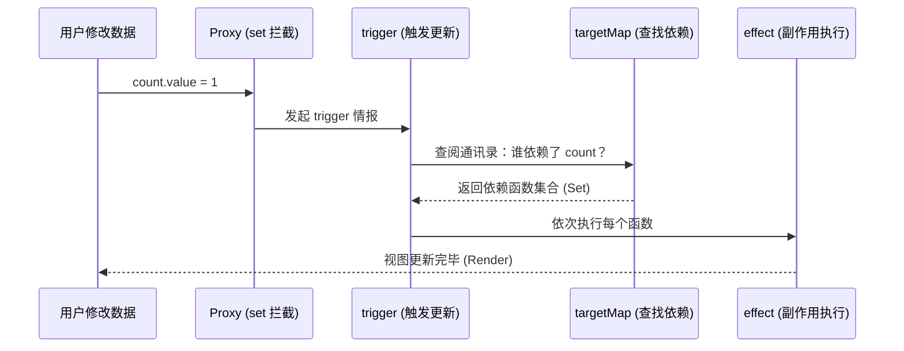

> 响应式系统是 Vue 的核心驱动。通过对底层 Proxy 拦截与依赖追踪机制的学习，我们能更高效地编写高性能的 Vue 应用。

# Vue 响应式系统原理深度解析

---

## 1. 什么是响应式数据？

> **响应式数据 = 当它的值发生变化时，所有依赖此数据的地方都会执行预定的更新动作。**

```javascript
// 在 Vue 3 组件中
const count = ref(0); // 声明响应式数据
// 模板中使用 {{ count }}

count.value = 1; // 数据一变，页面自动刷新。
```

> **你的疑问**：*“数据变了，Vue 是怎么‘感知’到的？”*
> **答**：Vue 3 底层利用 JavaScript 原生的 `Proxy`（代理）特性，“拦截”了你对数据的读（get）和写（set）操作。它就像快递员，你拿包裹或寄包裹，他都要记录和派发。

---

## 2. 响应式系统三大核心环节

### 🔹 步骤 1：数据劫持 (Data Hijacking)

Vue 通过 `Proxy` 为普通 JSON 对象穿上一层“外衣”。

```javascript
const state = reactive({ count: 0 });
// 内部实现：
// new Proxy({ count: 0 }, {
//   get(target, key, receiver) { ... },
//   set(target, key, value, receiver) { ... }
// })
```

- **`get`**：只要有人读取 `state.count`，就会进入这个函数。
- **`set`**：只要有人修改 `state.count`，就会进入这个函数。

> **你的疑问**：*“receiver 参数有什么用？”*
> **答**：它能确保不管数据怎么被继承或间接访问，拦截函数里的 `this` 永远指向这个代理对象本身，避免追踪数据时出错。

---

## 🔹 步骤 2：依赖收集 (Dependency Tracking)

在 `get` 拦截器里，Vue 需要搞清楚：**现在又是谁在用我这块数据？**

```javascript
get(target, key, receiver) {
  track(target, key); // ← 这里是关键！记录下“是谁读了我”
  return Reflect.get(target, key, receiver);
}
```

- **谁读了我？** 就是当前的副作用函数（如组件的渲染函数）。
- **记在哪？** 记在一个名为 `targetMap` 的全局“通讯录”中（结构：`对象 -> 属性 -> 依赖函数列表`）。

---

## 🔹 步骤 3：派发更新 (Triggering Updates)

在 `set` 拦截器里，数据变了，得发通告。

```javascript
set(target, key, value, receiver) {
  const result = Reflect.set(target, key, value, receiver);
  trigger(target, key); // ← 这里是关键！通知所有“盯着我”的人
  return result;
}
```

- **`trigger` 会做什么？** 它会翻开 `targetMap` 通讯录，找到这个对象这个属性对应的所有副作用函数（effect），然后挨个执行一遍。

---

## 3. 核心执行逻辑图 (Mermaid)



---

## 4. `effect` 与 `render` 的亲密关系

我们写 Vue 模板时没见过 `effect`，因为这是 Vue 自动包装的。

组件挂载时，Vue 底层会执行类似如下代码：

```javascript
// Vue 内部伪代码
effect(() => {
  const vnode = render(); // 执行渲染函数，这里会读数据，触发 track
  patch(vnode, container); // 将结果反映到真实 DOM
});
```

- **首次运行**：执行 `render`，数据被访问，`track` 记录依赖。
- **后续更新**：数据变了，`trigger` 发现依赖了该数据的 `render` 函数，于是重跑这段逻辑。

---

## 面试总结（标准回答）

> “Vue 3 的响应式系统是基于 **Proxy + effect + track/trigger** 协同工作的。
>
> 1. **Proxy** 用于劫持对象的读写操作；
> 2. 当在 **effect**（如组件渲染函数）中访问响应式数据时，通过 `get` 拦截触发 **track** 依赖收集，将当前的依赖（activeEffect）存储在全局的 `targetMap` 中；
> 3. 当数据发生变更时，通过 `set` 拦截触发 **trigger** 派发更新，它会从 `targetMap` 中检索出所有相关的副作用函数并重新执行；
> 4. 由于 **render 函数被自动包装在 effect 中**，所以它能自动感知数据变化，从而高效、精确地驱动视图更新。
>
> 相比 Vue 2，这种设计解决了无法监听属性增删、数组下标变化的痛点，并通过惰性代理和 WeakMap 的使用，大幅优化了内存和初始化性能。”
