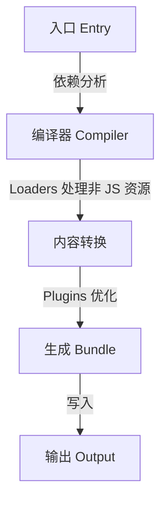

> 现代前端工程化的基石。Webpack 本质上是一个静态资源打包工具。

## 1. Webpack 核心工作流程



---

## 2. 五大核心概念

### **入口 (Entry)**
告诉 Webpack 从哪里开始打包。支持单入口或多入口配置。

### **输出 (Output)**
打包后的文件放在哪里，以及如何命名。

### **Loader (加载器)**
Webpack 默认只认识 JavaScript 和 JSON。Loader 负责把 CSS、图片、Vue/React 组件转换成 Webpack 能识别的模块。
- `css-loader` & `style-loader`
- `babel-loader` (处理 ES6+)

### **Plugin (插件)**
Loader 负责转换，Plugin 负责更广泛的任务：打包优化、压缩文件、修改环境等。
- `HtmlWebpackPlugin` (自动生成 HTML 并引入 bundle)
- `CleanWebpackPlugin` (清空输出目录)

### **模式 (Mode)**
分为 `development`、`production` 和 `none`。

---

## 3. 基础配置示例 `webpack.config.js`

```javascript
const path = require('path')
const HtmlWebpackPlugin = require('html-webpack-plugin')

module.exports = {
  mode: 'development',
  entry: './src/index.js',
  output: {
    path: path.resolve(__dirname, 'dist'),
    filename: 'main.js'
  },
  module: {
    rules: [
      {
        test: /\.css$/,
        use: ['style-loader', 'css-loader']
      }
    ]
  },
  plugins: [
    new HtmlWebpackPlugin({ template: './src/index.html' })
  ]
}
```

> [!WARNING]
> **Loader 顺序**：在配置 `use` 数组时，Loader 是**从右往左**（或从下往上）执行的。例如 `['style-loader', 'css-loader']` 会先执行 `css-loader`。

---

## 4. 总结
虽然 Vite 很火，但 Webpack 至今仍是大多数大型复杂项目的首选，掌握它的核心设计思想能让你对前端构建流程有更深刻的认知。
