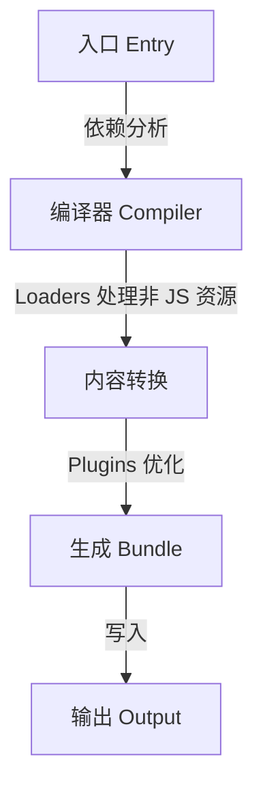

<ArticleViews slug="webpack-basics" />

> 现代前端工程化的基石。Webpack 本质上是一个静态资源打包工具。

## 1. Webpack 核心工作流程

```mermaid
graph TD
    Entry[入口 Entry] -->|依赖分析| Compiler[编译器 Compiler]
    Compiler -->|Loaders 处理非 JS 资源| Transform[内容转换]
    Transform -->|Plugins 优化| Bundler[生成 Bundle]
    Bundler -->|写入| Output[输出 Output]
```

